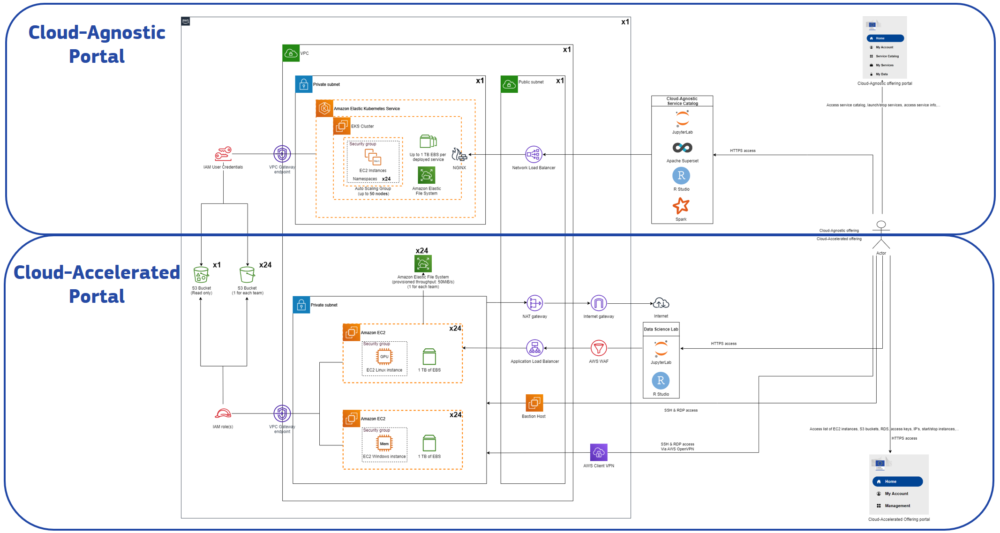

# Hackathon infrastructure overview

The 2023 EU Big Data hackathon IT infrastructure is provided by the [EC Data platform](https://ec-europa.github.io/digit-dataplatform/) and it contains 2 main parts as depicted below:

 - [Cloud agnostic](cloud-agnostic.md) environment based on EKS
 - [Cloud accelerated](cloud-accelerated.md) environment based on AWS services 

