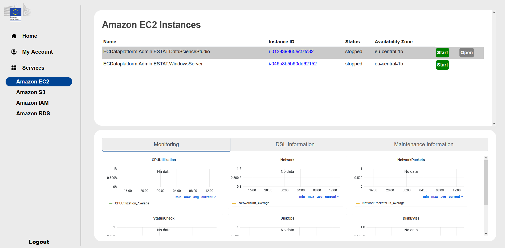

# Cloud accelerated datalab

The Cloud Accelerated Datalab is web service to easily manage the cloud-based resources provided to each team like the S3 buckets, EC2 machines and IAM credentials. It is ***a secondary service*** for the hackathon


***Typical use case***

It can be used if the services in the Cloud Agnostic Datalab does not fulfill your needs. For example, you need to leverage GPU power to run computationally expensive data processing/ML tasks or you need root access to install a specific tool/software. Also this is the place where you can get temporary AWS access credentials to have programmatic access to the S3 Buckets of the hackathon.


The Cloud Accelerated Datalab is available under this address: [The address will be provided here on 2nd March 2023](cloud-accelerated.md)

## Login

To access the Login page you have click on the **Log In** button


For access to the service you have to click on the EC DataPlatform Azure AD.


There you have to use the provided Azure AD login credentials which you received previously and activated with MFA.


## Home

After successful login you arrive at the home screen of the Cloud Accelerated Datalab.


Here you can find a link to this documentation and the terms of use of these services. ***Please read it at least once,*** because by using these services you agree those terms. 

## My Account

Under the **My Account** you find your Azure AD identifier, your name, your email which is used in the MS Teams group and where you receive the information about your Azure AD account activation. In addition, you will find here the of your group.

The sub menu *Cost Reports* is not used during the hackathon.


## Services 

Under the **Services** you find the list of AWS services you can manage from the Cloud Accelerated Portal. 

### Amazon EC2

Under the **Amazon EC2** you can start and stop a Linux server or a Windows server with root access/administrator rights.



The status can be *stopped, pending, running* or *stopping*. 


 ```{dropdown} Linux server


It is a [g5.4xlarge](https://instances.vantage.sh/aws/ec2/g5.4xlarge) instance with 16 cores, 64 GB RAM and with an NVIDIA A10G GPU. It is an Ubuntu 20.04.4 LTS Linux server with a data science image on it and it is accessible with 3 options:
 1. The simplest way is to click on the **Open** button when it is blue and it open a web intarface in a new window.
 2. Through [bastion host](https://ec-europa.github.io/digit-dataplatform/user_documentation/bastion_host_connection/)
 3. In exceptional cases when point 2 does not work it is possible through [AWS client VPN](https://ec-europa.github.io/digit-dataplatform/user_documentation/aws_client_vpn/)  
 
If you want to use option 2 or 3 you can find the internal address of the server under the link of the **Instance ID**. The IP address of the bastion host will be provided on request.  

The data science image contains:
 - an RStudio server with R 4.2.0 and the following packages: *base, boot, class, cluster, codetools, compiler, datasets, foreign, graphics, grDevices, grid, KernSmooth, lattice, MASS, Matrix, methods, mgcv, nlme, nnet, parallel, rpart, spatial, splines, stats, stats4, survival, tcltk, tools, utils*  
 - Jupyterlab 3.4.2 with Python 3.8.10 with the following packages: *apturl, argcomplete, attrs, Automat, blinker, boto3, botocore, certifi, chardet, Click, cloud-init, colorama, command-not-found, configobj, constantly, crit, cryptography, dbus-python, defer, distro, distro-info, dnspython, ec2-hibinit-agent, entrypoints, git-remote-codecommit, gpg, hibagent, httplib2, hyperlink, idna, importlib-metadata, incremental, Jinja2, jmespath, jsonpatch, jsonpointer, jsonschema, keyring, language-selector, launchpadlib, lazr.restfulclient, lazr.uri, Markdown, MarkupSafe, mate-hud, mate-menu, mate-tweak, more-itertools, netifaces, oauthlib, olefile, onboard, packaging, pexpect, Pillow, pipx, protobuf, psutil, pyasn1, pyasn1-modules, pycairo, pycrypto, Pygments, PyGObject, PyHamcrest, PyJWT, pymacaroons, PyNaCl, pyOpenSSL, pyparsing, pyrsistent, pyserial, python-apt, python-dateutil, python-debian, python-xlib, pyxdg, PyYAML, requests, requests-unixsocket, s3transfer, SecretStorage, service-identity, setproctitle, simplejson, six, sos, ssh-import-id, systemd-python, Twisted, ubuntu-advantage-tools, ubuntu-drivers-common, ufw, unattended-upgrades, urllib3, userpath, wadllib, xkit, zipp, zope.interface*
 - terminal access
 - Ubuntu MATE 1.24.0 desktop 

The access credentials are the the login name of the Azure AD email and password.

 ```

 ```{dropdown} Windows server


It is a [r5.8xlarge](https://instances.vantage.sh/aws/ec2/r5.8xlarge) instance with 32 cores and 256 GB RAM. It is a Windows 2022 server without any pre-installed software. 
It is accessible through Remote Desktop (RDP) connection on port 3389 tunneling through a bastion host. There is no direct **Open** link to it like for the Linux server.  If you click on the **Instance ID** you can find the address of the server. The access credentials are the full Azure AD email and password.    
 ```

### Amazon S3

Under the **Amazon S3** you have the name of the buckets available to you. There is a read only bucket with a source data and a bucket with the name of your team where you can save intermediate results. The buckets are accessible from both environments (Cloud Agnostic Datalab and Cloud Accelerated Datalab). There is also a link to open the AWS console to view the S3 buckets, but **in the console no actions can be done**. 


### Amazon IAM

Under the **Amazon IAM** you can download the already predefined AWS IAM roles for programmatic access. Also here can temporary credentials generated to the programmatic access for S3. 


### Amazon RDS

It is not used for the hackathon.

## Limitations

The Cloud Accelerated Datalab has the following restrictions:

 - The Linux and Windows server has seperate disks of 1TB and not accessible from the Cloud Agnostic Datalab
 - The EFS storage of the Cloud Agnostic Datalab is not accessible from the Cloud Accelerated Datalab
 - Don’t update services’ version manually/from the UI
 - This does not apply to second level software packages such as libraries etc.
 - Users are limited when accessing AWS Management Console - only S3 view access and no actions possible
 - The user cannot launch an EC2 instance (or an RDS instance) directly from the portal, only Start/Stop and access the applications running on the instances

