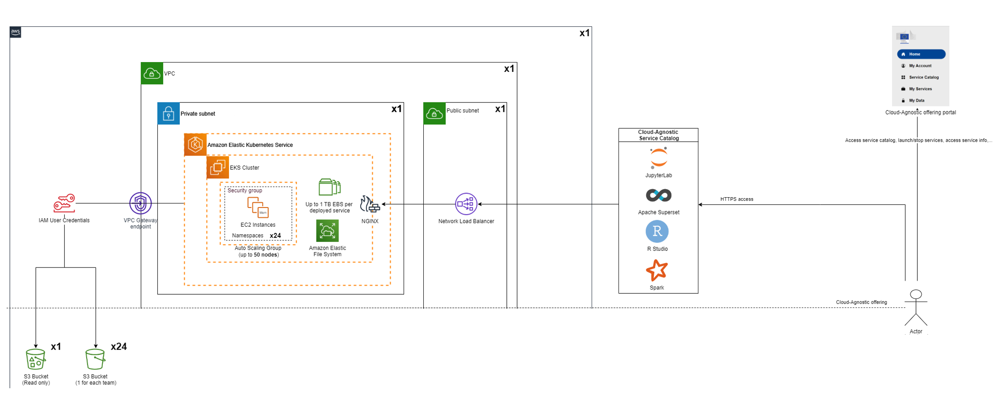
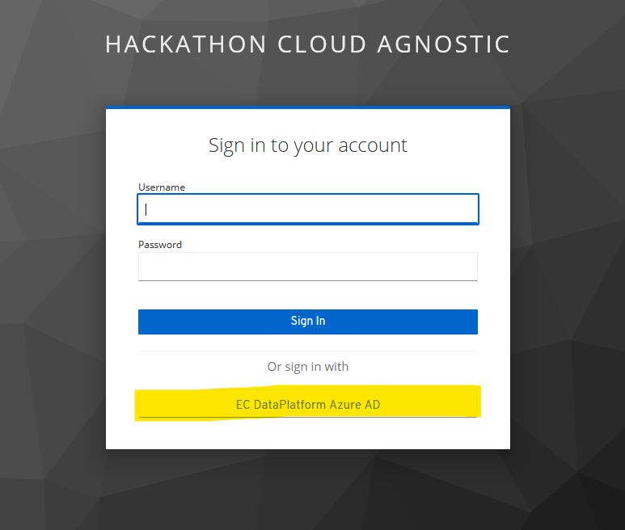
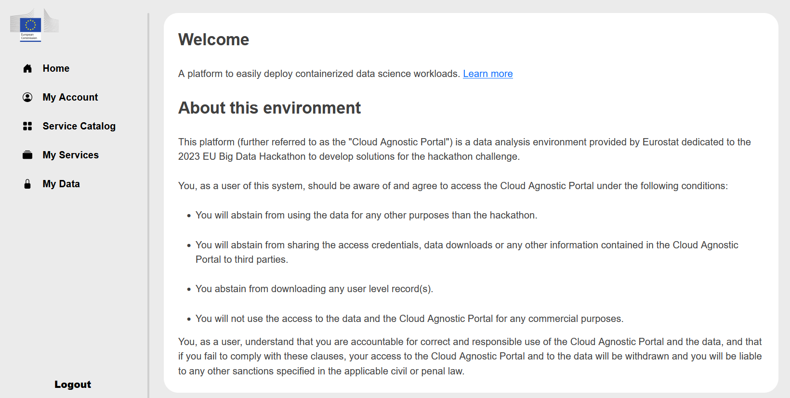
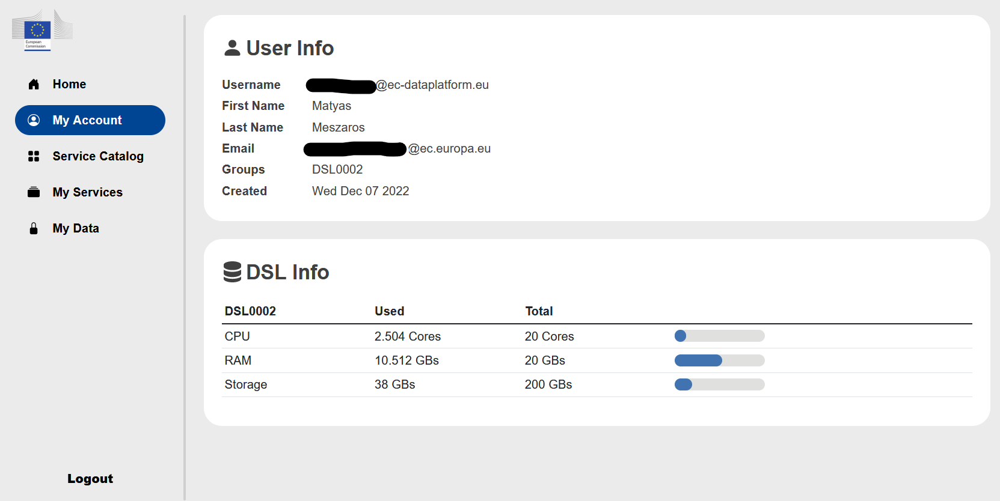
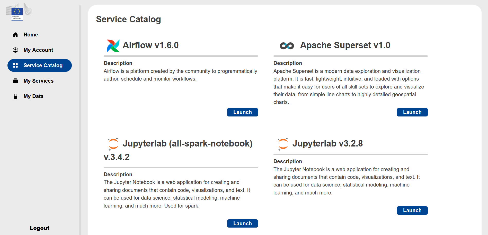
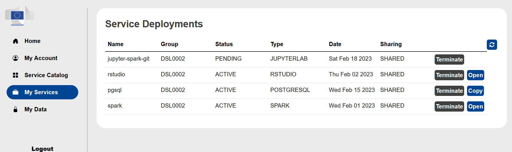
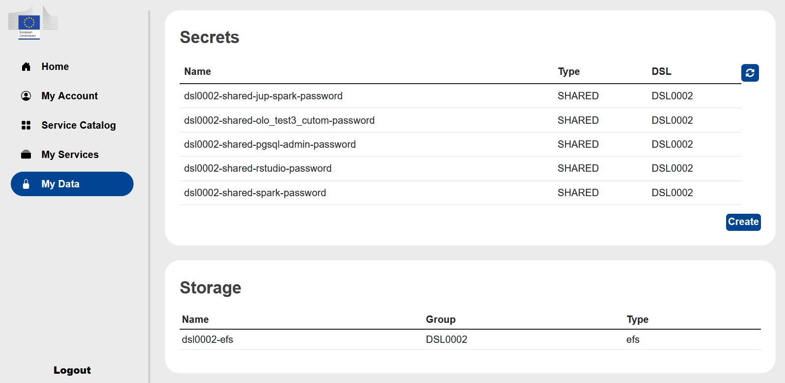
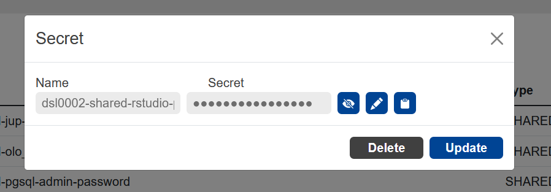

# Cloud agnostic datalab

The Cloud Agnostic Datalab is a web service to easily deploy and use containerized data science services like JupyterLab, Rstudio, Spark, Superset and PostgreSQL. It is the main service provided for the hackathon.



***Typical use case***

It can be used if you want to read data from S3 buckets (with programmatic access) and do some data processing with R/Python/Spark and finally you can create a specific data view, push it to PostgreSQL database and create a custom dashboard with Superset.

The Cloud Agnostic Datalab is available under this address: [The address will be provided here on 2nd March 2023](cloud-agnostic.md)

## Login

For access to the service you have to click on the EC DataPlatform Azure AD.



There you have to use the provided Azure AD login credentials which you received previously and activated with MFA.


## Home

After successful login you arrive at the home screen of the Cloud Agnostic Datalab.



Here you can find a link to this documentation and the terms of use of these services. ***Please read it at least once,*** because by using these services you agree those terms. 


## My Account

Under the **My Account** you find your Azure AD identifier, your name, your email which is used in the MS Teams group and where you receive the information about your Azure AD account activation. In addition, you will find here the use of resources for your Data Science Lab (DSL) available for your group. Each team have 128 vCPU and 512 GB RAM.



## Service Catalog

Under the **Service Catalog** you find the available services you can launch. 



You can choose from the following services:

```{dropdown} Apache Airflow v1.6.0

For the Airflow configuration you have to provide:
 - the name
 - if it is shared or private
 - the DSL of your group - there is only one possibility for your group
 - you have to select the configuration - the **Default** gives you predefined resources, for the **Custom** you can change some of them if the default does not work for you
 - you can change the provided username
 - you have to select the storage (NFS PVC name) - there is only one possibility for your group 
```

```{dropdown} Apache Superset v1.0

For the Superset configuration you have to provide:
 - the name
 - if it is shared or private
 - the DSL of your group - there is only one possibility for your group
 - you have to select the configuration - the **Micro** gives you predefined resources, for the **Custom** you can change some of them if the default does not work for you
 - you have to provide an admin username 
 - you have to provide an admin email, first name and last name 
```

```{dropdown} Jupyterlab (Spark) v3.4.2

For the Jupyterlab (Spark) configuration you have to provide:
 - the name
 - if it is shared or private
 - the DSL of your group - there is only one possibility for your group
 - you have to select the configuration - the **Default** gives you predefined resources, for the **Git** the Jupyterlab has pre-installed git extension
 - you have to select the storage (NFS PVC name) - there is only one possibility for your group 
```

```{dropdown} Jupyterlab v3.2.8

For the Jupyterlab configuration you have to provide:
 - the name
 - if it is shared or private
 - the DSL of your group - there is only one possibility for your group
 - you have to select the configuration - the **Micro** gives you predefined resources, for the **Custom** you can change some of them if the default does not work for you
 - you have to select the storage (NFS PVC name) - there is only one possibility for your group 
```

```{dropdown} PgAdmin v6.8

For the PgAdmin configuration you have to provide:
 - the name
 - if it is shared or private
 - the DSL of your group - there is only one possibility for your group
 - you have to select the configuration - the **Default** gives you predefined resources
 - you have to provide an admin email 
```

```{dropdown} PostgreSQL v14.2.0

For the PostgreSQL configuration you have to provide:
 - the name
 - if it is shared or private
 - the DSL of your group - there is only one possibility for your group
 - you have to select the configuration - the **Micro** gives you predefined resources
```

```{dropdown} RStudio v4.2.2

For the RStudio configuration you have to provide:
 - the name
 - if it is shared or private
 - the DSL of your group - there is only one possibility for your group
 - you have to select the configuration - the **Custom** allows you to change some of the resources if the default values does not work for you
 - you have to select the storage (NFS PVC name) - there is only one possibility for your group 
``` 

```{dropdown} Apache Spark v3.2.1

For the Spark configuration you have to provide:
 - the name
 - if it is shared or private
 - the DSL of your group - there is only one possibility for your group
 - you have to select the configuration - the **Default** gives you predefined resources, for the **Custom** you can change some of them if the default does not work for you
 - you have to provide a username
```

## My Services

Under the **My Services** you will find the list of services you launched. 



After the launch of a service it will have a status *PENDING*. A few minutes later refreshing the page the status should change to *ACTIVE* and the link to **Open** (or **Copy** for PostgreSQL) should show up in the last column. 
Clicking on the **Open** button the service will open in a new website.  
Here you can also **Terminate** services, and ***please terminate those services which are not used*** to save energy and allow your teammate to use them if necessary. 


## My Data

Under the **My Data** you will find the list of passwords/secrets created by the services you launched.



By clicking on the line of a service you can view, edit or copy to the clipboard the password of the service.



You can add also add additional secrets that you can use in the lauched services.


## Limitations

The Cloud Agnostic Datalab has the following restrictions:

 - The deployment configuration cannot be changed after its launch
 - It is not possible to manually update an automatically generated secret at the instance deployment
 - Later changing the secret under **My Data** will not change the password for the launched service
 - Each service is provided with a specific service’s version
 - Don’t update services’ version manually/from the UI
 - No root access for JupyterLab and RStudio
 - Not all libraries are installed, some libraries can be installed by the user if it does not require root access
 - Simultaneous access to the shared service of RStudio is limited, only one person can be connected to it
 - The storage quota of the DSL is not validated against its limits
